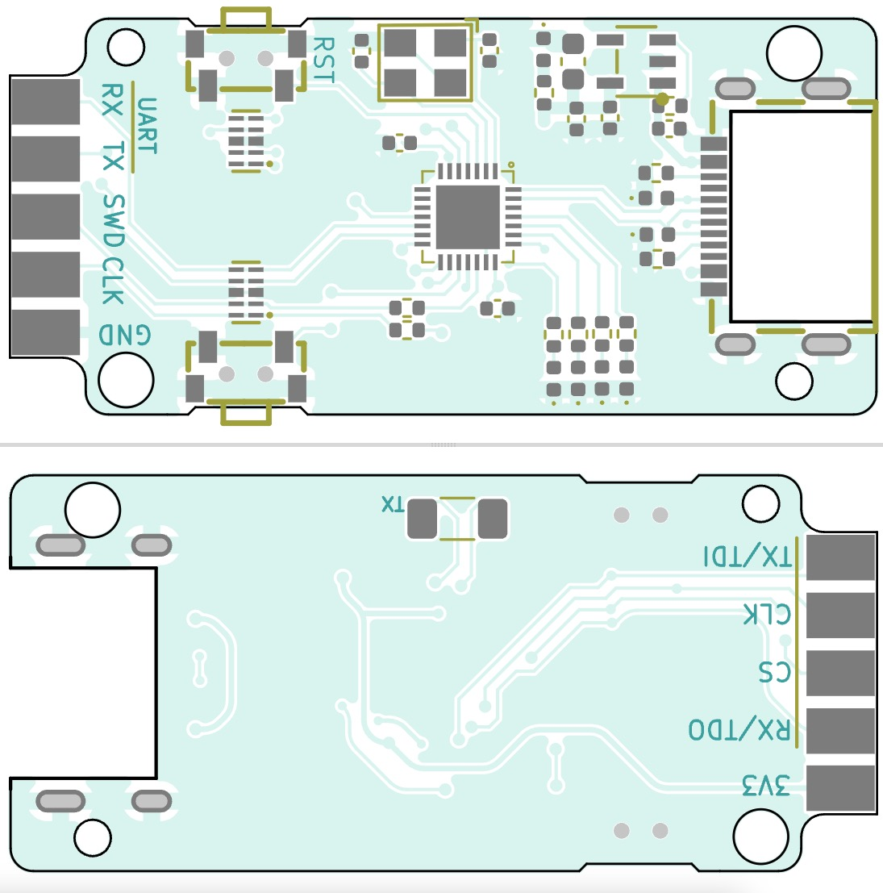
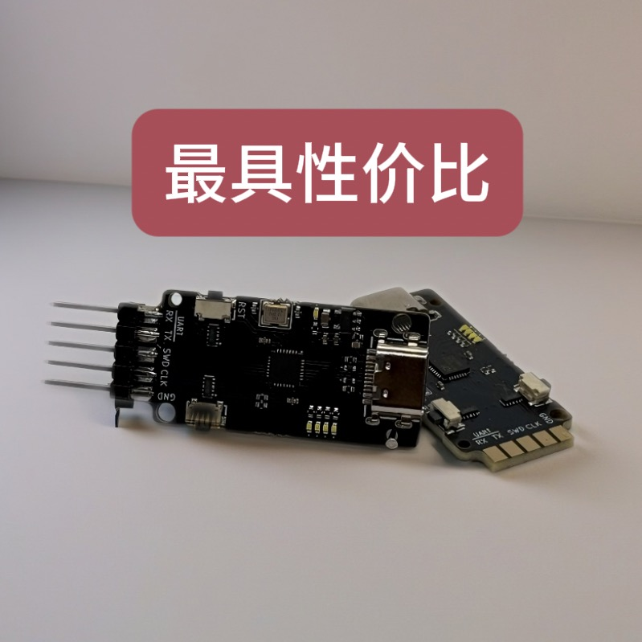
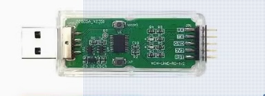
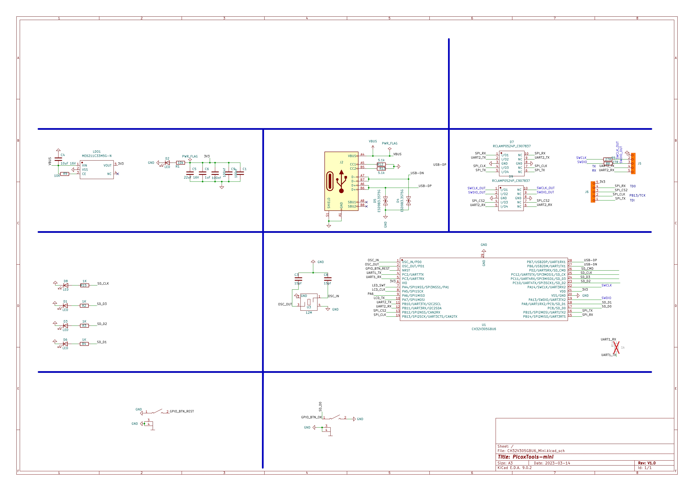

今天，我们满怀诚意地为大家介绍一款精心自制的 DAPLink 调试器，它以 CH32V305 为主控芯片，自带一路 USB 转串口功能，具备全面的 TVS/ESD 防护，在兼容官方固件基础上实现了性能的显著提升。




# WCH-LinkE

沁恒家的产品大家应该都用到过，特别是USB转串口可能用的比较多，他们家也有RISC—V的芯片，但是调试他家的芯片必须用专用的调试器，这就是他们官方出品的WCHLink，


采用自家的CH32V305的MCU，内置的高速的USB2.0(480M)
但奇怪的是 WCHLink使用的是全速的USB接口，也就是说USB通讯我们只能使用12M速率！这很奇怪，而且这是官方出品，不知道为什么这么拉跨，难道够用就行！还是摸鱼的选手不求进取。


## CH32V305主控芯片
我们的 DAPLink 调试器采用 CH32V305 作为主控芯片。高速的 USB 通讯能力更是其一大亮点，它能够以极快的速度传输数据，大大缩短调试和下载时间。在实际开发过程中，无论是复杂的程序调试还是大容量文件的快速下载，都能轻松应对，让您无需再为漫长的等待而烦恼，显著提升开发效率。

## 原理图


## 极速 USB 通讯，畅享流畅体验
高速 USB 通讯是这款 DAPLink 调试器的核心优势之一。它支持高速数据传输协议，能够在调试器与目标设备之间建立稳定、快速的连接通道。与传统调试器相比，数据传输速度大幅提升，使得调试过程更加流畅。想象一下，当您在进行实时调试时，能够迅速获取目标设备的运行状态信息，及时发现并解决问题，这将为您的开发工作节省大量时间和精力。无论是初学者进行简单的项目开发，还是专业开发者进行复杂的系统调试，都能深刻感受到高速 USB 通讯带来的卓越体验。

## 自带 USB 转串口，拓展功能边界
这款 DAPLink 调试器的一大创新之处在于自带一路 USB 转串口功能,最大支持9M波特率。在嵌入式开发中，串口通信是一种常见且重要的通信方式，用于设备之间的数据传输和调试信息输出。有了这个 USB 转串口功能，您无需额外携带 USB 转串口模块，大大简化了开发环境的搭建。无论是与外部传感器、模块进行数据交互，还是输出调试日志，都能轻松实现。这不仅节省了成本，还减少了硬件连接的复杂性，让您的开发过程更加简洁高效。

## 全面 TVS/ESD 防护，守护设备安全
在复杂的电磁环境中，TVS（瞬态电压抑制器）和 ESD（静电放电）对电子设备的威胁不容忽视。我们的 DAPLink 调试器在设计上采用了全面的 TVS/ESD 防护措施，对 USB 接口和 IO 端口进行重点保护。

在 IO 端口方面，同样配备了完善的防护机制。无论是在插拔外部设备时可能产生的静电，还是在信号传输过程中出现的瞬态干扰，都能得到及时有效的处理。这使得调试器在各种复杂的应用场景下都能稳定工作，延长了设备的使用寿命，减少了因静电和瞬态电压问题导致的故障和维修成本。

## UF2 固件升级，便捷无忧
为了方便用户进行固件升级和功能扩展，我们的 DAPLink 调试器支持 UF2 固件升级方式。UF2（USB Flashing Format）是一种专为嵌入式设备设计的简单、高效的固件更新格式，无需复杂的工具和操作步骤，只需将调试器通过 USB 连接到计算机，它就会自动识别为一个可移动存储设备。您只需将新的固件文件拖放到该存储设备中，即可完成固件升级。这种方式不仅简单易懂，而且安全可靠，大大降低了固件升级的难度和风险。

## 应用场景广泛
这款 DAPLink 调试器适用于各种嵌入式开发场景，无论是单片机开发、物联网设备调试，还是智能家居系统的开发，都能发挥出其强大的性能优势。它可以与多种开发板和目标设备兼容，为您的开发工作提供全方位的支持。无论是专业的嵌入式开发工程师，还是电子爱好者，都能借助这款调试器轻松实现自己的创意和想法。

如果您正在寻找一款高性能、功能丰富、安全可靠的调试器，那么我们这款自制的 DAPLink 调试器绝对是您的不二之选。它将以出色的性能、便捷的操作和广泛的兼容性，陪伴您在嵌入式开发的道路上不断前行，开启高效编程的新纪元！

## 有如下特点:
- 它可以兼容官方的固件，用来调试沁恒自家的RISC-V MCU
- 刷入自定义固件可以运行高速DAP-Link（USB 480M）

沁恒家提供的IDE是Mount River，可以从它的发行版里获取到WCHLink的固件，WCHLink固件是不开源的，
依据它的原理图我画了块简单的板子它具备全面的TVS/ESD防护
CH32V305资源还是比较丰富的 ：CAN 、 SDO 等一应俱全。Flash 128K ;RAM有32K，内置了高速的USB2.0 PHY 这是比较诱人的。芯片的成本大概是¥8.5左右。

我们发现MountRiver提供了两个WCH-link的固件：
- FIRMWARE_CH32V305.bin
- WCH-LinkE-APP-IAP.bin

大概研究一下 这两个固件只是头部不同，相差了8K ,后面的内容完全一样 。前面的 8k应该是Bootloder，也就是说WCHLink内置一个 BootLoader来加载不同固件（RV/ARM）
因此我们可以自己实现一个BootLoader来加载不同的App可以实现不同的功能，比如实现自己的高速DAP-Link. 

>在需要时的时候也可以恢复官方固件,调试它自家的 MCU。主要步骤：
>- 上电时按住 Boot(上方)键进入 bootloader
>- 通过虚拟出来的U盘进行固件升级

## 如何生UF2
当前目录执行
```shell
sh ./gen_uf2_fw.sh
```
当前目录下产生固件：HiSpeed_DapLink.uf2，将其拖入Bootloader在盘符CH32VBOOT完成烧录。


## where buy:)
[淘宝小店](https://picsum.photos/id/40/600/400)有售，没生产多少，近成本价，如果自行研究开发，建议买一对，一个可以烧录WCHLink的固件来调试另一块。


